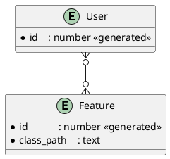

# Feature Switcher

Example of "Feature Toggle" pattern. The main idea is to isolate feature related logic in separated class and store its class path in related storage. For example lets consider the next data model:

We can easily load needed feature and load related class for using. It's also can be useful for A/B testing, etc.